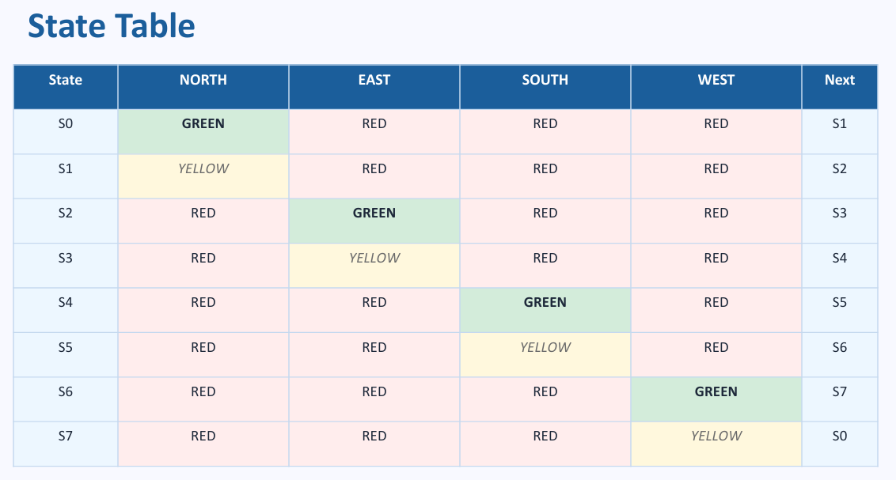
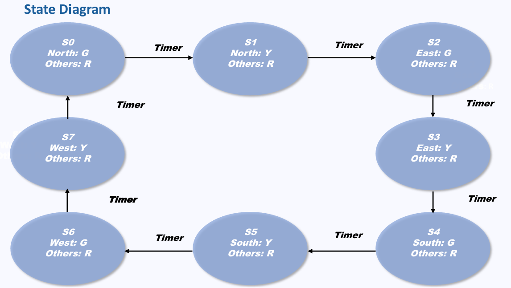
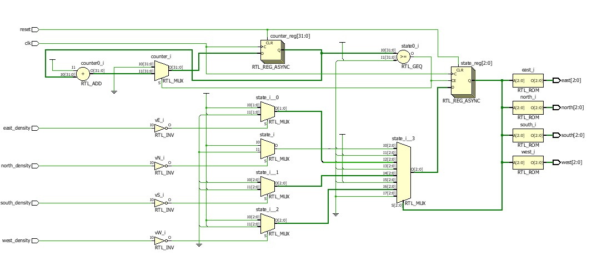
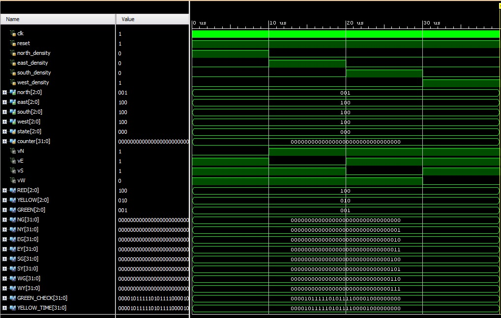
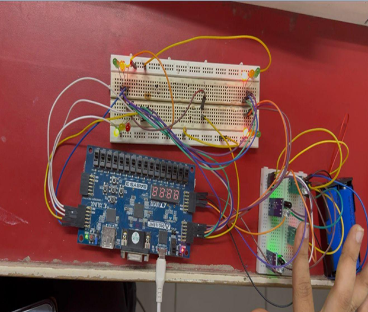

Adaptive Traffic Light Controller using Verilog HDL on FPGA and PCB Hardware Demonstration

Overview

This project demonstrates the design and implementation of an Adaptive Traffic Light Controller using Verilog HDL and FPGA technology.
The system controls a 4-way traffic junction using a Moore Finite State Machine (FSM) and dynamically adjusts signal timing based on traffic density inputs.
The project was developed as part of the VLSI Design subject in Sem-4 (ECE).

---

Objective

Design a 4-way traffic light controller using FSM

Implement the design using Verilog HDL

Simulate and verify traffic signal sequencing

Deploy the design on FPGA hardware

Demonstrate adaptive traffic control using density sensors.

---

Software & Hardware Used

Xilinx Vivado

Verilog HDL

Basys 3 FPGA Board (Artix-7 XC7A35T)

Breadboard / Custom PCB

LEDs for Traffic Signal Indication

---

Network / System Architecture

4-way traffic junction

Moore FSM-based controller

Density-based adaptive timing

FPGA-driven real-time signal control

---

FSM States

State Diagram 

---

Introduction

Traffic congestion is one of the major problems in urban areas. Conventional traffic systems generally operate on fixed timing, which often causes unnecessary delays and inefficient traffic flow.

This project introduces an FPGA-based adaptive traffic controller that:

Improves traffic management efficiency

Reduces manual intervention

Ensures safe signal transitions

Supports real-time operation

---

Working Principle

Step 1: State Initialization

The FSM starts from the North Green (NG) state.

Step 2: Timer-Based Operation

A counter controls GREEN and YELLOW phase durations.

Step 3: Adaptive Control

Traffic density sensors determine whether the current GREEN phase should continue or move to the next direction.

Step 4: Sequential Transition

The FSM cycles through all traffic directions safely.

---

Verilog Design Features

• Moore FSM Architecture
• 8 Traffic States
• Adaptive Timing Logic
• Counter-Based Timing Control
• Separate Sequential & Combinational Blocks
• FPGA-Compatible Design

---

FPGA Configuration

Signal	Pin

clk	W5
reset	U18
north_density	K3
east_density	M3
south_density	M1
west_density	N1

I/O Standard

LVCMOS33

---

Commands / Design Flow

1. Create Vivado Project
2. Add Verilog Source Files
3. Add XDC Constraints File
4. Run Synthesis
5. Run Implementation
6. Generate Bitstream
7. Program FPGA

---

Output Observation

Correct FSM state transitions observed

Adaptive timing successfully verified

No signal conflicts detected

Real-time operation achieved on FPGA

Proper RED/YELLOW/GREEN sequencing verified

---

Screenshots

RTL Schematic

Simulation Waveform

Hardware Implementation

---

Advantages

Real-time FPGA execution

Fully reprogrammable design

Scalable for larger intersections

Reliable and conflict-free operation

Supports adaptive traffic management

---

Limitations

Limited to prototype-level implementation

Basic density sensing logic

No wireless/IoT integration

No emergency vehicle prioritization

---

Learning Outcomes

Understanding Moore FSM design

Practical exposure to Verilog HDL

FPGA implementation using Vivado

Traffic signal sequencing logic

Hardware-software integration concepts

---

Comparison with Existing Systems

Parameter	Manual System	Timer IC System	FPGA-Based System

Flexibility	Low	Medium	High
Reliability	Low	Medium	High
Scalability	Poor	Poor	Excellent
Reprogrammable	❌	❌	✅
Simulation Support	❌	Limited	✅

---

Future Scope

AI-Based Traffic Optimization

Emergency Vehicle Detection

Pedestrian Signal Integration

IoT-Based Smart Traffic Systems

Camera-Based Vehicle Detection

---

Conclusion

This project successfully demonstrated the implementation of an FPGA-based Adaptive Traffic Light Controller using Verilog HDL. The FSM-based architecture ensured safe and efficient traffic signal operation, while adaptive timing improved traffic handling efficiency. The design was verified through simulation and successfully deployed on FPGA hardware.

---

Team Members

Khushi Desai

Siya Bhalala

Haiya Patel

Jharna Nakrani

---

Guided By

Prof. (Dr.) Nehal Shah
Prof. Chintan Panchal
Prof. (Dr.) Ketki Pathak

---

Project Type

Mini Project – VLSI Design (BTEC13404)